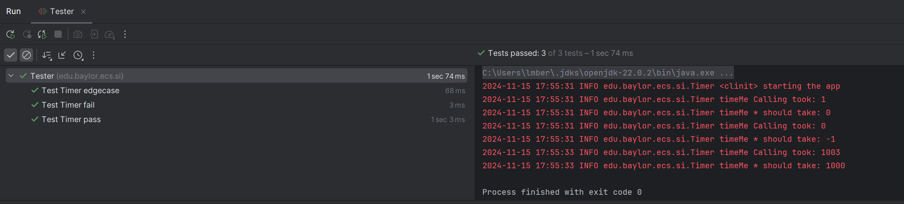
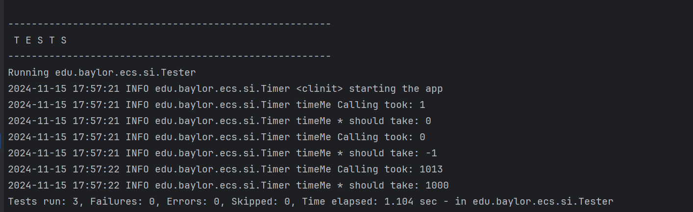

Tasks to answer in your own README.md that you submit on Canvas:

1.  See logger.log, why is it different from the log to console?
1.  Where does this line come from? FINER org.junit.jupiter.engine.execution.ConditionEvaluator logResult Evaluation of condition [org.junit.jupiter.engine.extension.DisabledCondition] resulted in: ConditionEvaluationResult [enabled = true, reason = '@Disabled is not present']
1.  What does Assertions.assertThrows do?
1.  See TimerException and there are 3 questions
    1.  What is serialVersionUID and why do we need it? (please read on Internet)
    2.  Why do we need to override constructors?
    3.  Why we did not override other Exception methods?	
1.  The Timer.java has a static block static {}, what does it do? (determine when called by debugger)
1.  What is README.md file format how is it related to bitbucket? (https://confluence.atlassian.com/bitbucketserver/markdown-syntax-guide-776639995.html)
1.  Why is the test failing? what do we need to change in Timer? (fix that all tests pass and describe the issue)
1.  What is the actual issue here, what is the sequence of Exceptions and handlers (debug)
1.  Make a printScreen of your eclipse JUnit5 plugin run (JUnit window at the bottom panel) 
1.  Make a printScreen of your eclipse Maven test run, with console
1.  What category of Exceptions is TimerException and what is NullPointerException
1.  Push the updated/fixed source code to your own repository.

1. Due to the logging parameters, the logger.log differs from the console in that it offers more information. For instance, INFO, FINE, and FINER. 
2. The ConditionEvaluator is where the line originates. In essence, this checks for the @Disabled annotation and records specific findings, such as whether the tests should be enabled or disabled. It logs true or false depending on whether it is present.
3. assertThrows throws NullPointerException instead of the expected TimeException. Because the exception types are different, an AssertionFailedError results.
4. a. During the deserialization process, the serialVersionUID, a unique identifier for the Serialized class is used to confirm that the classes of the sender and the receiver of a serialized item are compatible.
   b. In order to handle customer exceptions, we must override the constructors. 
   c. Since they already offer the required information, there is no need to alter the initial implementation. Its behavior will remain unchanged since providing information is the exception's primary goal.
5. The class's logger configuration is loaded using Timer's static block. The configuration used in "logger.properties" is loaded. The static block is called when the class is first loaded.
6. The README.md is associated with Bitbucket since it is the main documentation format for any repository hosted on Bitbucket. It provides an overview of the project's features and purpose. 
7. Timer.timeMe()'s NullPointerException is the cause of the failure since TimeNow is null. The Timer class should be modified to so that timeNow is assigned to an actual TimeNow object.
8. The issue is that when the timeNow variable is used in the finally block, it is not initialized correctly in every code path. 
Exception Sequence: A TimerException stating that the timeToWait cannot be less than zero is thrown when it is negative. When the finally block is ran, it raises a NullPointerException since the timeNow is never properly supplied a value. The UnitTest delivers a NullPointerException instead of the TimerException it expects, which causes the test to fail.
9. 
10. 
11. TimerException is a checked exception because it extends the exception class. On the otherhand, the NullPointerException is an uncheck exception because it extends the RunTimeException class causing it to not enforce handling of this exception.
12. https://github.com/Lucas-CSI/Lab11-exceptionrunner

